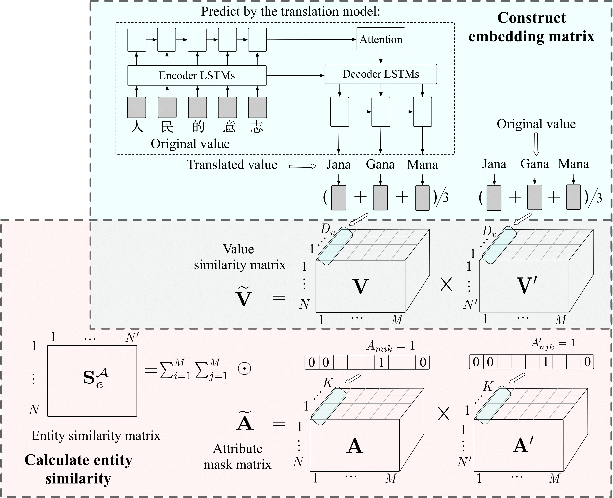

# PAKDD-20-JarKA
Pytorch implemetation of PAKDD'20---"JarKA: Modeling Attribute Interactions for Cross-lingual Knowledge Alignment"

## Whole Framework


## Dependencies

* Python 3.6
* Pytorch "1.1.0"
* CPU/GPU


## How to run

```bash
Comming soon...
```

## Extensive Experiments

### Dataset discription

We evaluate the proposed model on three datasets. One is a well-adopted public dataset named DBP15K, the other two, named DBP15K-1 and DBP15K-2, modify DBP15K. DBP15K-1 loosens the constraint as 2 self-contained relationship triplets, and DBP15K-2 further removes the self-contained constraint. Thus, the clustering of the three datasets is different. Table 1 shows the statistics of the datasets.

[...]

### Overall experiment results

[...]

### Sensitivity to Graph Clustering
We compare JarKA and BootEA on three ZH-EN datasets in Fig. 4(a), which shows that both of them perform poorer when the clustering coefficient (cc) of the dataset is smaller. But their performance gap increases with the decrease of cc, indicating BootEA is more sensitive to the clustering characteristics of the graph than JarKA, as BootEA only models the structures.

[...]


